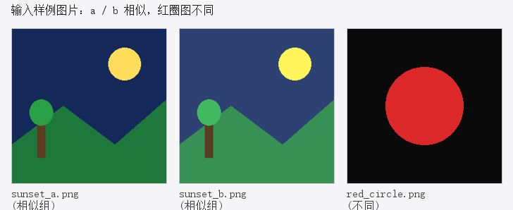
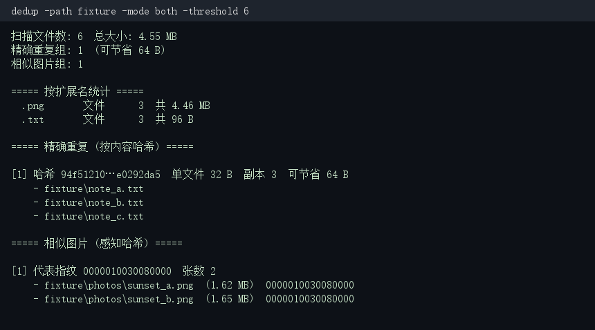
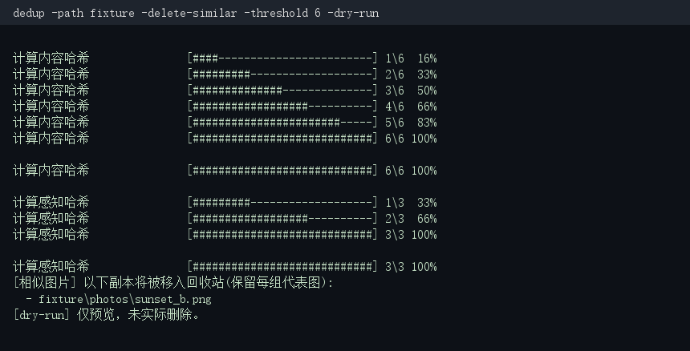

# dedup — 本地文件去重 / 相似图片查找 CLI

一个用 **Go** 编写的命令行工具，用来：
1. **精确去重**：按文件内容（SHA-256）找出完全相同的文件；
2. **相似图片查找**：用感知哈希（dHash）找出肉眼几乎一样的图片（即使被压缩 / 改尺寸 / 调了亮度）。

全部使用 **Go 标准库 + Windows API** 实现，**零第三方依赖**，编译出来是单个二进制文件，可直接分发。

## 特性
- 🔍 精确去重（SHA-256 内容哈希），并发计算，自动按可回收空间排序
- 🖼️ 相似图片查找（64 位 dHash + 汉明距离），支持 JPG/PNG/GIF/BMP/WebP/TIFF
- 📊 **实时进度条**（stderr，不污染 stdout 报告）+ **按扩展名统计**（文件数 / 总大小）
- 📑 **CSV 导出**：把重复 / 相似结果导出为表格，便于二次处理
- 🗑️ **安全删除**：把重复文件移入系统回收站（绝不 `rm`）
  - `-delete`：精确重复，每组保留一个
  - `-delete-similar`：相似图片，保留每组代表图，**删除前二次确认**
  - 两者均支持 `-dry-run` 预览与 `-yes` 跳过确认
- 📄 三种报告格式：终端文本 / JSON / HTML（HTML 带图片缩略图）
- ⚡ 并发扫描与哈希（worker pool），可指定 `-workers`
- 🧹 忽略规则：隐藏文件、指定目录（`.git` / `node_modules`）、最小/最大文件大小、扩展名过滤

## 安装

### 从源码
```bash
git clone https://github.com/kll237/dedup.git
cd dedup
go build -o dedup .
```

### go install
```bash
go install dedup@latest
```

## 使用

```bash
# 1) 找出某目录下所有精确重复文件（默认 text 报告，输出到终端）
dedup -path "D:/Photos"

# 2) 同时查精确重复 + 相似图片
dedup -path "D:/Photos" -mode both

# 3) 只查相似图片，汉明阈值调到 8（更严格）
dedup -path "D:/Photos" -mode image -threshold 8

# 4) 生成 HTML 报告（带缩略图），写到文件
dedup -path "D:/Photos" -format html -out report.html

# 5) 机器可读的 JSON 报告
dedup -path "D:/Photos" -format json -out report.json

# 6) 导出 CSV（列：type, group, path, size_bytes, sha256, phash, hamming_distance）
dedup -path "D:/Photos" -csv report.csv

# 7) 预览将要删除的重复文件（不真正删除）
dedup -path "D:/Photos" -delete -dry-run

# 8) 真正把重复副本移入回收站（每组保留按路径排序的第一个）
dedup -path "D:/Photos" -delete

# 9) 相似图片安全删除，删除前会要求确认；-yes 可跳过确认
dedup -path "D:/Photos" -delete-similar
dedup -path "D:/Photos" -delete-similar -yes
```

### 常用参数
| 参数 | 说明 | 默认 |
|------|------|------|
| `-path` | 要扫描的路径（可多次指定），也可用位置参数 | — |
| `-mode` | `exact` / `image` / `both` | `both` |
| `-format` | `text` / `json` / `html` | `text` |
| `-out` | 报告输出文件（默认 stdout） | 空 |
| `-csv` | CSV 导出文件（与 `-out` 独立的扁平表格） | 空 |
| `-threshold` | 相似图片汉明距离阈值（0-64，越小越严格） | `10` |
| `-min-size` / `-max-size` | 文件大小过滤，如 `1KB` / `10MB` | `0` |
| `-workers` | 并发数（默认 = CPU 核数） | `0` |
| `-skip-hidden` | 跳过隐藏文件和目录 | `true` |
| `-ignore` | 跳过的目录名，逗号分隔 | `.git,.node_modules` |
| `-delete` | 把精确重复的额外副本移入回收站（保留每组一个） | `false` |
| `-delete-similar` | 把相似图片的额外副本移入回收站（保留代表图，需确认） | `false` |
| `-yes` | 跳过删除前的二次确认 | `false` |
| `-dry-run` | 仅预览待删除文件，不实际删除 | `false` |

## 效果演示

下面这些截图来自**真实 CLI 输出**（样例数据在 `docs/assets/` 同一次运行中生成）。

### 输入样例图片

两张图只是亮度与位置略有变化，`red_circle.png` 是明显不同的图：



### 终端扫描报告

同时检测精确重复（3 个 txt 文件内容相同）与相似图片（2 张 sunset 图被归为一组）：



### 删除安全确认（dry-run 预览）

`-delete-similar -dry-run` 会先列出将被移入回收站的副本，并显示实时进度条：



## 架构

```
main.go          命令行解析、流程编排、删除决策
├── scan/        递归遍历文件系统，应用过滤规则
├── hash/        内容哈希（SHA-256）+ 并发分组（精确去重）
├── imageph/     图片解码 → 灰度 → 缩放 → dHash → 并查集分组（相似图片）
├── report/      文本 / JSON / HTML 三种报告渲染（HTML 内嵌缩略图）
├── trash/       调用系统回收站（Windows: SHFileOperationW；其他: gio/trash-put）
└── result/      跨包共享的数据结构
```

### 关键设计
- **精确去重**：`hash.FindExact` 用固定数量的 goroutine 并发计算 SHA-256，结果按内容哈希归组，每组文件数 > 1 即为重复。
- **相似图片**：先算每张图的 64 位 dHash 指纹，再用**并查集（union-find）**把汉明距离 ≤ 阈值的图片合并成组，时间复杂度 O(n²)，对常规相册规模足够快。
  - dHash 流程：解码 → 灰度化 → 缩放到 9×8 → 比较相邻像素亮度 → 得到 64 位指纹。对缩放、压缩、轻微调色鲁棒。
- **安全删除**：Windows 下通过 `shell32.dll!SHFileOperationW`（`FOF_ALLOWUNDO`）把文件移入回收站，可还原；绝不调用 `os.Remove`。`-delete` 针对精确重复（保留每组一个，无需确认即可执行预览），`-delete-similar` 针对相似图片（非逐字节相同，删除前强制二次确认，可用 `-yes` 跳过）；两者都有 `-dry-run` 预览。

## 性能
- 内容哈希瓶颈在磁盘 I/O，并发读取可充分利用多核 / 多磁盘。
- 相似图片为 O(n²) 两两比较；对上万张图片建议在 CI/脚本里分批，或提高 `-threshold` 先用精确哈希去重减少候选。

## 技术博客 / 实现解析

想了解背后的算法与工程取舍，可以看（在线版 ↓ / 仓库版在 `docs/`）：

- 🌐 [感知哈希（dHash）如何识别"相似图片"](https://kll237.github.io/dedup/blog-dhash.html) · [仓库版](docs/blog-dhash.md)
  —— 灰度、缩放、差分、汉明距离、阈值调参，以及 dHash 在"纯色/均匀图"上退化的坑。
- 🌐 [为什么删除要用回收站而不是 `rm`](https://kll237.github.io/dedup/blog-recyclebin.html) · [仓库版](docs/blog-recyclebin.md)
  —— `SHFileOperationW` 的 `FOF_ALLOWUNDO` 机制、返回码为 2 实则成功的怪癖、跨平台方案与"绝不永久删除"的安全设计。

## License
[MIT](LICENSE)
